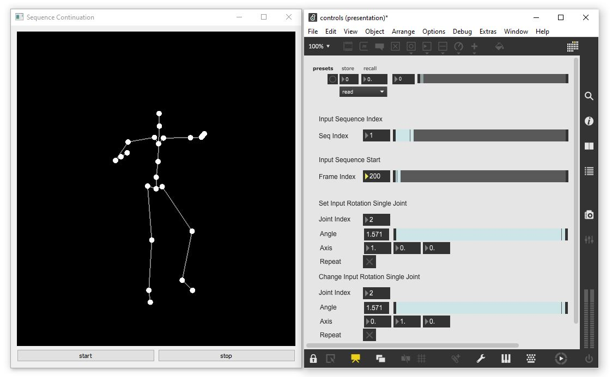

# Sonosphere - Motion Continuation

Figure 1: Screenshot of the generative AI software. The generative AI produces the motion of a dancing figure represented as a stick figure (left side). A graphical user interface provides the possibility to intervene with the motion generation process (right side).

### Software Description

The motions performed by the AI-controlled dancing figure are synthetically generated. The AI was trained of movement material that dancer [Marcella Centenero](https://www.facebook.com/marcella.centenero/) employed while interactive with the [SphericalSoundPlayer software](https://github.com/ewgnr/Sonosphere/tree/main/SphericalSoundfilePlayer_v8_Win). The dancers movements were captured at the [Advanced Motion-Capturing Laboratory](https://ibms.hs-offenburg.de/en/) in Offenburg using a professional [Qualisys](https://www.qualisys.com/) motion capture system.

The generative AI uses a neural network model consisting of classical LSTM units ([Hochreiter and Schmidhuber, 1997](https://www.bioinf.jku.at/publications/older/2604.pdf)). This model is trained in an autoregressive procedure and uses a curriculum learning strategy ([Wang et al., 2021](https://arxiv.org/abs/2010.13166)). The generative AI learns to predict future dance motions based on a short starting motion sequence. These predicted and thus synthetic motions represent variations of the original dance recordings and reflect its movement repertoire and stylistic design. At the same time, the synthetic motions deviate significantly from the original in their longer course. The synthetic motions alter the temporal sequence of movement motifs, combine motions from different improvisations, emphasize repetitive elements, and occasionally stagnate. Thus, the AI occupies in its behavior a middle ground between an authentic reproduction of the danced original and the autonomous creation of new dance motions.

The generative AI functions in real-time, and its movement generation can be interactively influenced. Currently, there are two possibilities for influence: 1. The selection of a new starting sequence to be continued by the model. 2. Overwriting individual joint orientations in the movement sequence that the model uses as input. The first variant leads to significant changes in the movements generated by the model, while the second variant only minimally changes and continues the generated movements.

## Authors
* <a href="https://github.com/bisnad">Daniel Bisig</a>
* <a href="https://github.com/ewgnr">Ephraim Wegner</a>
