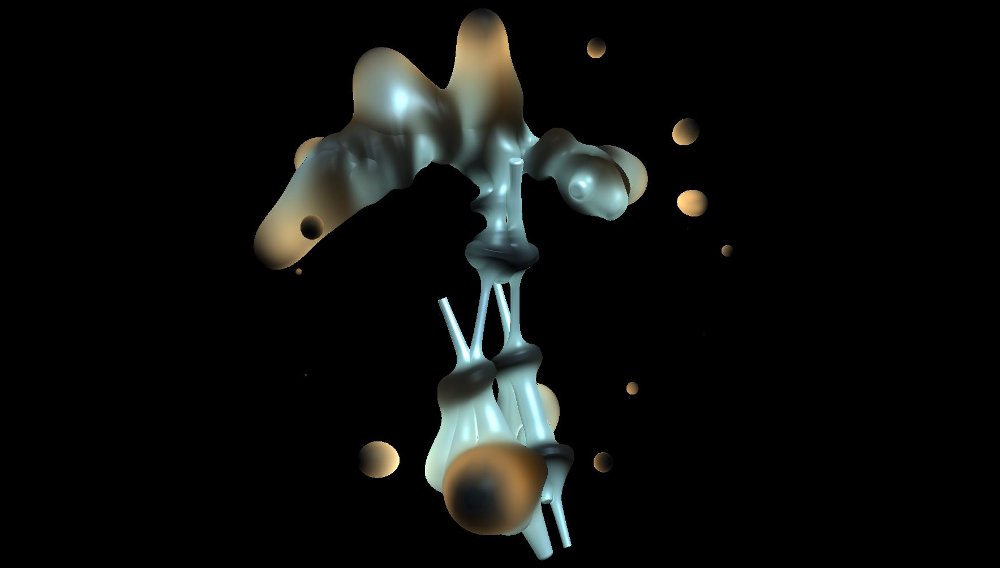

# Sonosphere - Raymarching

Figure 1: Screenshot of a graphical rendering of a dancing figure surrounded by sound points. The rendering employs the Ray marching technique.).

### Software Description

The Raymarching tool forms part of [*Sonosphere*](https://github.com/ewgnr/Sonosphere/tree/main) and provides the possibility to depict the dancing figure and sound points as an abstract visual entity. 

Ray marching ([Hart, 1996](https://d1wqtxts1xzle7.cloudfront.net/41025/1n2a4cyrc7h6ck096z48.pdf?1737681290=&response-content-disposition=inline%3B+filename%3DSphere_tracing_A_geometric_method_for_th.pdf&Expires=1740929957&Signature=dnT4iBQK7bhCO5XwsmOcFQE8BIRJp2j2UlsIFvm5oqyW9w~t~SgTz-w8yMqzSXvZ09U4FIy8qZ3GdCVlDWgtUoxqG9edVBkFRfMkgAYfz4f5H~F2NxNxiVngbipZ0eUYTzUGzvHQ0aScBVAVchN-0iv4-08hf9iCQGCyB8381M0~AwTHom9JZs0niE3hoxENOKDUX-b0b-e90dmPxdJKNY4IrONeVL6QW9Py~Oyoet1PsVN3hhVGVITiSz66G24fu2r~vnwZnwkzddAbgdz2CTcIlmk5pid9bPxjRPUWw-kMLy~1qiIvfeiUoTdXzUKmB-ijr1O-qCttYHlrk6zWhg__&Key-Pair-Id=APKAJLOHF5GGSLRBV4ZA)) is based on the principle of a ray that scans a virtual space for collisions with geometric primitives. The ray is emitted for each pixel of the image to be produced. The geometric primitives are mathematically described as functions that calculate the distance between a point in space and the primitive’s surface. The method is computationally demanding, but offers the possibility that primitives can be easily deformed and merged into intricate and seamless surfaces. This possibility can be exploited to vary the appearance of the dancing figure and the sound points and to merge them into a singular visual entity. The appearance can continuously vary between humanoid, amorphous, and platonic forms. The generated image thus conveys the status of the artificial dancer as an entity that combines technical-mathematical and natural-human-like properties and merges with the digital instrument in which it is embedded. An example animation is available [online](https://vimeo.com/1056474449). This animation illustrates the rendering of the dancing avatar and sound points using several different parameter settings for the Ray marching technique.

## Authors
* <a href="https://github.com/bisnad">Daniel Bisig</a>
* <a href="https://github.com/ewgnr">Ephraim Wegner</a>
