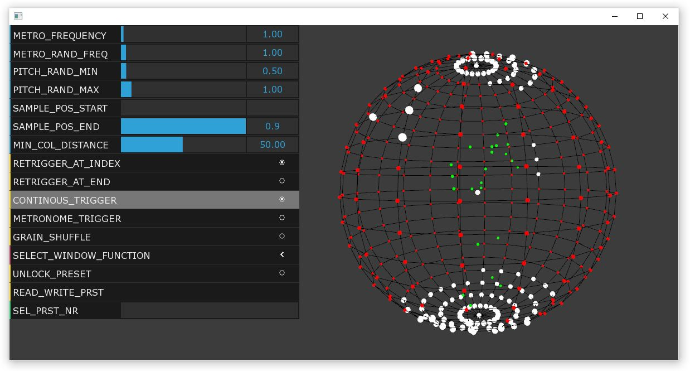

# Sonosphere - Spherical Sound Player Windows Version

Figure 1: Screenshot of the spherical sound player software. The sound points and the dancing avatar are represented as simple 3D visualisation on the right side. In this visualisation, small green dots represent the joints of the dancing avatar, small red dots represent inactive sound points, and large white dots represent sound points that are currently played. The graphical user interface for configuring the parameters for audio playback is shown on the left.

### Software Description

The sounds are generated using a digital instrument that can be played by a dancing figure. This figure is either controlled by a human dancer whose motions are captured in real-time or by a machine learning model that generates synthetic dance motions. The instrument consists of several sound points distributed on the surface of a virtual sphere. An audio file is assigned to each sound point. The dancing figure is located at the center of this sphere and triggers the playback of an audio file by approaching the corresponding sound point with one of their extremities. Thus, the digital instrument adopts the principle of the Laban Kinesphere ([Brooks 1993](https://www.hugoribeiro.com.br/biblioteca-digital/Brooks-Harmony_in_space-Rudolf_Laban.pdf)). The Kinesphere contains those spatial points that can be reached by a dancer by extending their extremities without having to change their position in space. By successively reaching these points, symmetrical movement trajectories, so-called trace-forms, are created.

The number of sound points and the selection and assignment of audio files significantly influence both compositional and choreographic decisions. The assignment can either be conducted automatically by sorting the audio files according to sonic properties or it can be determined manually. Various options are available for playing the audio files. The audio files can be triggered either when falling below or exceeding the minimum distance between the sound node and the dancer. The triggering can occur once or repeatedly, after or before the respective file has stopped playing. The audio files can be played in their full length, only as a small excerpt, or recombined using granular synthesis ([Roads 1988](https://www.jstor.org/stable/3679937?seq=1)). It is possible to randomly vary the playback speed. The positioning of the sound on the sound sphere can be reproduced through third order Ambisonics ([Hollerweger 2005](http://decoy.iki.fi/dsound/ambisonic/motherlode/source/HOA_intro.pdf)) over multiple speakers.

## Authors
* <a href="https://github.com/bisnad">Daniel Bisig</a>
* <a href="https://github.com/ewgnr">Ephraim Wegner</a>
